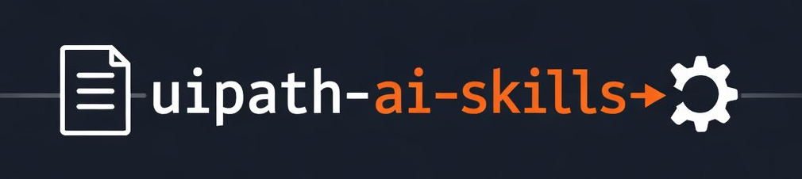

  

# UiPath AI Skills

> Transform natural language into production-ready UiPath automations using Coding Agents, Agent Builder, deterministic workflow generation, and enterprise-grade validation.

  

## Overview

UiPath AI Skills is an agent-powered automation development platform that enables coding agents such as Claude Code, Codex, Cursor, and Gemini CLI to create production-ready UiPath Studio projects from natural language requirements.

Instead of allowing large language models to generate fragile or invalid XAML directly, the platform combines AI reasoning with deterministic workflow generators, validation pipelines, framework scaffolding, and governance controls to ensure every generated automation can be opened, validated, and deployed within the UiPath ecosystem.

The result is a faster path from Process Definition Document (PDD) to enterprise-ready automation while maintaining the reliability, governance, and quality standards required for production environments.

---

# AgentHack Challenge Alignment

This project was built for UiPath AgentHack and demonstrates how Coding Agents and UiPath platform capabilities can work together to create, validate, and operationalize enterprise automations.

The solution extends coding agents with specialized UiPath automation skills that:

* Analyze business requirements and PDDs
* Generate complete UiPath projects
* Scaffold REFramework architectures
* Build workflows from structured specifications
* Validate generated artifacts
* Detect and prevent hallucinated UiPath activities
* Enforce development best practices
* Produce deployable automations for UiPath Automation Cloud

The project focuses on solving one of the biggest challenges in agentic automation development:

> Moving from AI-generated prototypes to production-ready enterprise automations.

---

# UiPath Components Used

## UiPath Agent Builder

Agent Builder serves as the AI orchestration layer for interpreting business requirements and coordinating automation generation workflows.

The platform leverages Agent Builder to create low-code AI agents capable of:

* Understanding automation requirements
* Generating automation plans
* Coordinating generation workflows
* Managing validation processes
* Interacting with automation tools

## UiPath Studio

UiPath Studio serves as the target runtime environment.

Generated automations include:

* Sequence Projects
* REFramework Dispatcher Projects
* REFramework Performer Projects
* Object Repository Assets
* Config-driven workflows
* Production-ready XAML

Every generated workflow is designed to open successfully in UiPath Studio without requiring manual reconstruction.

## UiPath API Workflows

API Workflows provide reusable enterprise tools that agents can invoke during automation creation and validation.

These workflows enable:

* Secure API integrations
* Enterprise system connectivity
* Controlled execution of automation services
* Standardized business operations
* Reusable automation capabilities

## UiPath Automation Cloud

Automation Cloud provides deployment, governance, monitoring, and execution capabilities for generated automations.

Generated projects are designed to be published and managed through the UiPath cloud ecosystem.

## UiPath Orchestrator

Orchestrator provides:

* Package management
* Asset management
* Queue management
* Process deployment
* Execution monitoring
* Enterprise governance

## UiPath Coding Agents

The solution is specifically designed for coding agents including:

* Claude Code
* Codex
* Cursor
* Gemini CLI

These agents use UiPath AI Skills to transform natural language requirements into deployable UiPath projects.

---

# Agent Type

## Coded Agents

The project uses coded agents to:

* Analyze Process Definition Documents
* Generate automation specifications
* Scaffold projects
* Create workflows
* Refactor existing automations
* Generate automation assets

Supported coding agents include Claude Code, Codex, Cursor, and Gemini CLI.

## Low-Code Agents

The project also utilizes UiPath Agent Builder to create and orchestrate low-code AI agents within the UiPath platform.

## Hybrid Agent Architecture

This solution combines both coded agents and low-code agents.

Coding agents provide reasoning, planning, and automation generation capabilities while UiPath Agent Builder provides orchestration, governance, and enterprise deployment capabilities.

This hybrid architecture allows organizations to benefit from advanced AI-assisted development while maintaining enterprise-grade control and governance.

---

# The Problem

Large Language Models are excellent at understanding business requirements but struggle to generate valid UiPath projects.

Common issues include:

* Invalid XAML
* Hallucinated activities
* Incorrect namespaces
* Broken selectors
* Missing framework components
* Studio compatibility issues
* Invalid package references

These problems often result in hours of manual repair before an automation can be executed.

---

# The Solution

UiPath AI Skills introduces a deterministic generation architecture.

Instead of generating XAML directly, AI agents generate structured specifications.

The platform then:

1. Validates requirements
2. Creates project scaffolding
3. Generates workflows using deterministic generators
4. Validates generated artifacts
5. Detects hallucination patterns
6. Applies framework wiring
7. Produces production-ready UiPath projects

This approach ensures reliability, consistency, and enterprise readiness.

---

# Key Features

* Natural language to UiPath automation
* REFramework generation
* Deterministic XAML generation
* Hallucination prevention
* Validation and auto-fix pipeline
* Object Repository generation
* Config-driven architecture
* Plugin-based extensibility
* Multi-agent support
* Enterprise governance support
* Studio compatibility validation
* Automation Cloud deployment readiness

## Supported Agents

* Claude Code
* OpenAI Codex
* Cursor
* Gemini CLI
* Future coding agent integrations

## Supported Automation Types

* Web Automation
* Desktop Automation
* Queue Processing
* Queue Dispatching
* API Integrations
* Email Automation
* Excel Automation
* PDF Processing
* Human-in-the-Loop Workflows
* Multi-System Enterprise Processes
